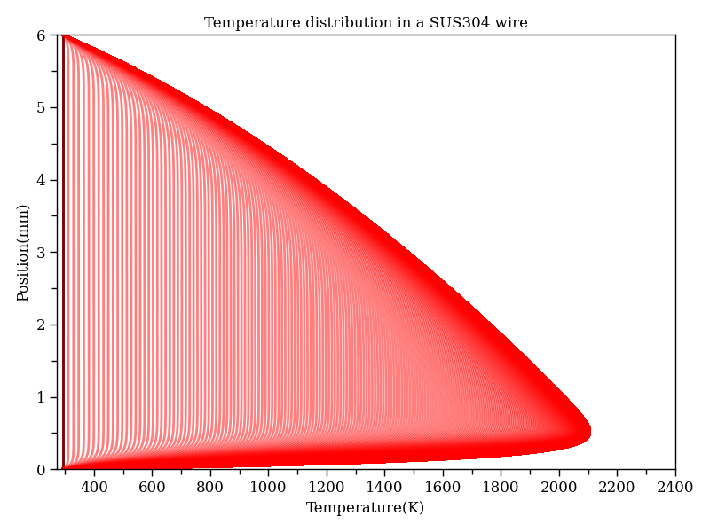

# c3d-petsc-1d
1D temperature field simulation for Joule direct energy deposition additive manufacturing using petsc4py



## Quick Start
1. Install petsc4py
```bash
python3 -m venv venv

source venv/bin/activate

pip install -r requirements.txt
```

2. Run the simulation
```bash
./simulation.py
```

## Parameters
- `-D` or `--diameter`: Diameter of the wire (default: 1.2mm)
- `-L` or `--length`: Length of the wire (default: 6.0mm)
- `-v` or `--velocity`: Feedrate of the wire (default: 30mm/s)
- `-U` or `--voltage`: Voltage of the wire (default: 1.45V)
- `--Nx`: Number of elements in the x direction (default: 1000)
- `--dt`: Time step size (default: 0.001s)
- `--Tf`: Final time (default: 1.0s)

